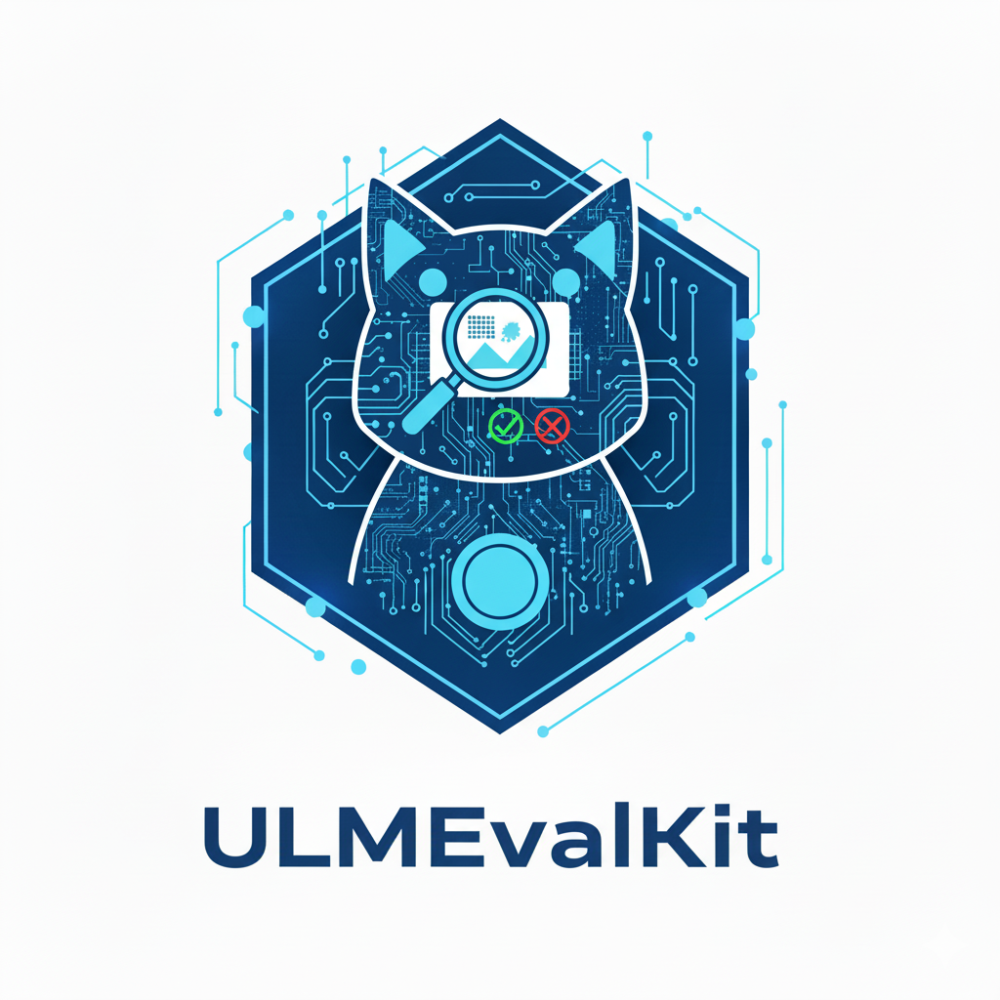

# ULMEvalKit: One-Stop Eval ToolKit for Image Generation

<p align="center">
     <br>
</p>

<a href="#%EF%B8%8F-quickstart">🏗️ Quickstart </a> • <a href="#-datasets-models-and-evaluation-results">📊 Datasets & Models </a> • <a href="#%EF%B8%8F-development-guide">🛠️ Development </a>

 <a href="#-the-goal-of-ulmevalkit">🎯 Goal </a> • <a href="#-contributors">🥳 Contributors </a> • <a href="#-acknowledgement">👍 Acknowledgement </a> • <a href="#%EF%B8%8F-citation">🖊️ Citation </a>

**ULMEvalKit** (Python package: **ulmeval**) is an open-source evaluation toolkit on **generation benchmarks** for **unified understanding & generation models (ULMs) and generative models**. It enables **one-command evaluation** of ULMs on various generation benchmarks, eliminating the heavy workload of data preparation across multiple repositories.

**Key Features:**
- Currently supports text-to-image and image-text-to-image generation tasks
- Distributed inference and evaluation support
- Flexible evaluation with both local models (CLIP, Mask2Former) and API models (GPT-4o)

## 🆕 News

- **[2025-10-09]** 🚀🚀🚀 Release **ULMEvalKit v0.1**. Contributions are welcomed!

## 🏗️ QuickStart

See [[QuickStart](/docs/en/Quickstart.md)] for a quick start guide.

## 📊 Datasets, Models, and Evaluation Results

### Supported Models and Benchmarks

**Supported models:** BAGEL, FLUX.1, Janus-Pro,....

**Supported benchmarks:** GenEval, DPG-Bench, T2I-CompBench,....

See **full list** in [[Supported models and benchmarks](/docs/envs/README.md)].

We are continuously adding new models and benchmarks! If you are interested in contributing a new model or benchmark, see [Development](#%EF%B8%8F-development-guide) for details.

### Evaluation Results

**👣 Performance numbers of ULMs are on the way.**

### Environments

See [Models and Benchmarks Environment](/docs/envs/README.md) for detailed setup.

We **provide official environment requirements for all models and benchmarks**. While we recommend following these specifications, other versions may also work.

**Quick model environment verification:**

```python
# Demo
from ulmeval.config import supported_ULM
model = supported_ULM['Janus-Pro-1B']() # Input your model name here, according to ulmeval/config.py
ret = model.generate(['A close-up high-contrast photo of Sydney Opera House sitting next to Eiffel tower, under a blue night sky of roiling energy, exploding yellow stars, and radiating swirls of blue.'], num_generations=2)
ret[0].save('./assets/photo0.png')
ret[1].save('./assets/photo1.png')
```

## 🛠️ Development Guide

To develop custom benchmarks, ULMs, or other features to **ULMEvalKit**, please refer to [[Development_Guide](/docs/en/Development.md)].

**Call for contributions**

To promote the contribution from the community and share the corresponding credit (in the next report update):

- All Contributions will be acknowledged in the report.
- Contributors with **3 or more major contributions** (implementing an ULM/Generative Models, benchmark, or major feature) can join the author list of ULMEvalKit Technical Report (in progress).

**Eligible contributors:** create an issue or contact jdzcarr7@gmail.com.

Here is a [contributor list](/docs/en/Contributors.md) we curated based on the records.

## 🎯 The Goal of ULMEvalKit

**The codebase is designed to:**

1. **Easy-to-use evaluation**: Provide an opensource evaluation toolkit to make it convenient for researchers & developers to evaluate existing ULMs and generative models with reproducible results.
2. **Developer-friendly**: Enable ULM developers to evaluate their models on multiple benchmarks by implementing just a single `batch_generate_inner()` or `generate_inner()` function—all other workloads (data downloading, data preprocessing, prediction inference, metric calculation) are handled by the codebase.

**The codebase is not designed to:**

Reproduce the exact accuracy number reported in the original papers of all **3rd party benchmarks**, due to:
1. **Ramdomness factors:**
   + Different random seeds across models (we default to seed 42 for image generation)
   + Variable temperature settings when using large multimodal models (e.g., GPT-4o, Qwen2.5-VL) for scoring, which may not be consistently zero across papers
2. **Different Prompt Version.** By default, we use exactly the same prompt in the benchmark. However, some models may use a rewrite version ,e.g., BAGEL.

## 🥳 Contributors
**Project Lead:** Dongzhi Jiang, Renrui Zhang

**Core Contributors:** Yankai Shu, Yuyang Peng, Zhuofan Zong, Yuchen Duan, Zihao Wang, Jiaming Liu, Hao Chen, Ziyu Guo, Junyan Ye

**Corresponding:** Renrui Zhang, Hongsheng Li, Rui Liu, Jiaming Liu, Shanghang Zhang, Pheng Ann Heng

## 👍 Acknowledgement

ULMEvalKit is a fork of [VLMEvalKit](https://github.com/open-compass/VLMEvalKit). We follow its major structure and class definitions with key modifications:

+ Inference results saved as pickle files (instead of TSV) to include images
+ Judgers moved to `ulmeval/dataset/utils` to support various types: local models (CLIP, Mask2Former) and API models (GPT-4o)
+ Added distributed evaluation support for judgers

## 🖊️ Citation

If you find this work helpful, please consider to **star🌟** this repo. Thanks for your support!

When using ULMEvalKit in your research or referencing published evaluation results, please cite:

```bib
@misc{jiang2025ulmevalkit,
  title={Ulmevalkit: An open-source toolkit for evaluating unified large multi-modal models and generative models},
  author={Jiang, Dongzhi and Zhang, Renrui and Shu, Yankai and Peng, Yuyang and Zong, Zhuofan and Duan, Yuchen and Wang, Zihao and Liu, Jiaming and Chen, Hao and Guo, Ziyu and Ye, Junyan and Liu, Rui and Heng, Pheng Ann and Zhang, Shanghang and Li, Hongsheng},
  url={https://github.com/ULMEvalKit/ULMEvalKit},
  version={v0.1.0},
  month={October},
  year={2025}
}
```

<p align="right"><a href="#top">🔝Back to top</a></p>
